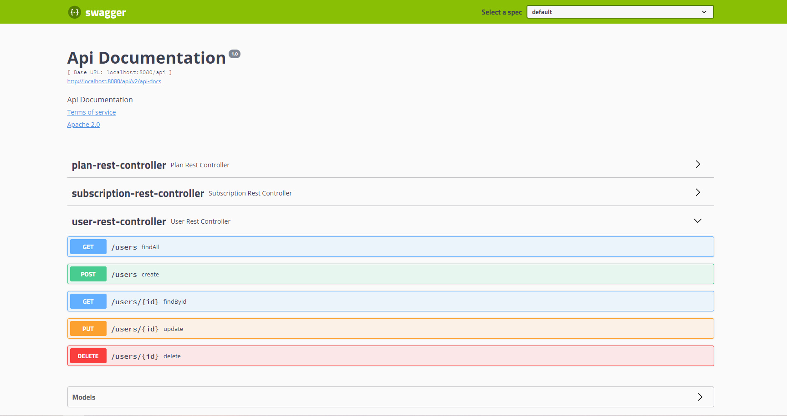
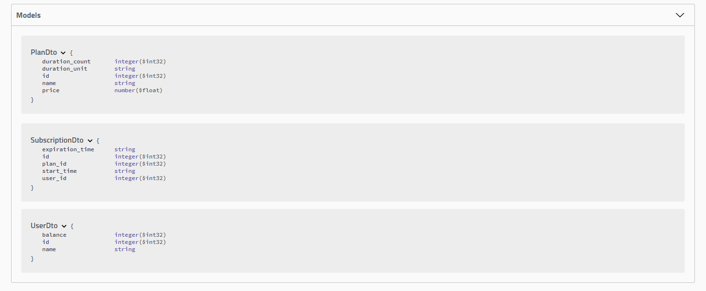

# subscription-service-api
Subscription service

## Technology stack
Java 8, Maven, Spring Boot, Spring Data, Spring Security, Postgresql, Mapstruct, JUnit, Mockito

## Quick start guide
1. Create postgres database and change the configuration in the properties `src/main/resources/application.properties`
2. Import the database schema `src/main/resources/db_schema.sql` into the database
3. Run the application, swagger web UI is accessible on `http://localhost:8080/api/swagger-ui/`, default credentials (username:password)

## Screenshots

